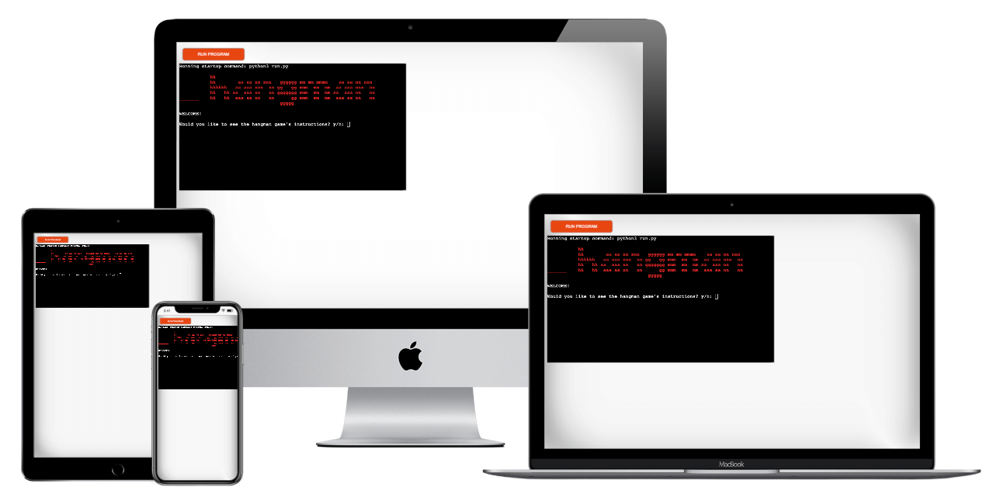

# HANGMAN GAME

Hangman Game is a Python terminal game, which runs in a mock terminal on Heroku.

Users can test their knowledge of english vacabulary. The game will allow the user to choose the word length they would like to play. They have a choice from four to nine letters. The user gets six lives to try to guess the secret word. A scoreboard will be visible with the user's high score and current max score. The game will give the user the option to get a hint, the word synonyms, when only one life remains. If the user loses, the secret word will be revealed and the player can opt to get the word's definition. These extra features added to the classic game, gives the user an educative experience while playing this Hangman Game. The game also allows the user to replay the game to increase their high score, which adds a fun and competitive element as well.

[View the live version of the Hangman Game project here](https://hangman-game-ci.herokuapp.com/)

---

## How To Play

Hangman Game is based on the classic paper-and-pencil game. You can read more about it on [Wikipedia](https://en.wikipedia.org/wiki/Hangman_(game)). In this version: 

- At the start of every game the player gets to choose the word length: from 4 to 9 letters.
- A hi-score will be displayed, reflecting the highest score attained by the player. A current max score will be calculated, which is the highest  attainable score for the game with the chosen word length.
- The game starts with 6 lives and with every wrong letter guess the player will lose a life. Every new game will start with the current max score displayed which will decrease when the player loses a life.
- When there is only one life left, the player will have the option to get a hint.
- The player will win when having guessed all the word letters before losing all  lives.
- The current max score remaining at the end of the game will be the final score for the game. If the game end score is higher than the displayed hi-score, the hi-score will be updated.
- If the player loses the game, the secret word will be revealed and the player will get the option to see the word's definition.
- At the end of every game the player will be given the option to replay the game to increase their hi-score or to exit the game. After the player exits the game, the game can be run again with the hi-score reset to zero.

