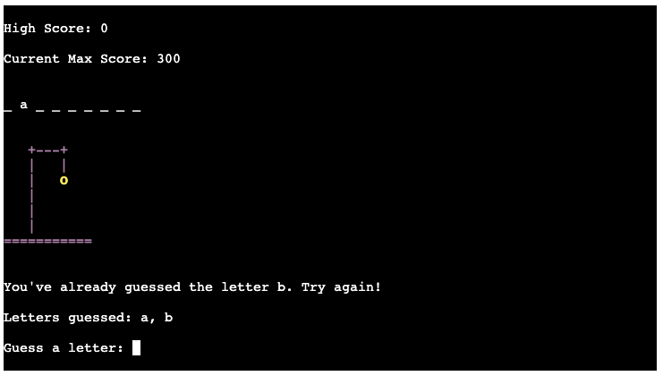
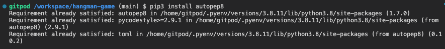
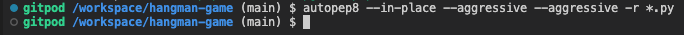
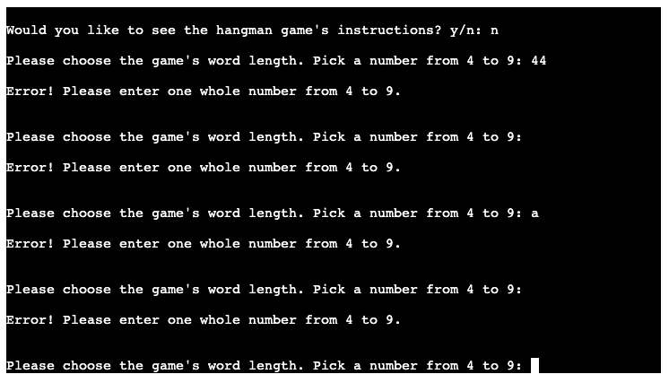
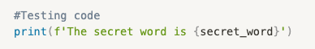
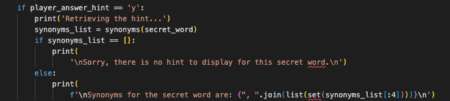
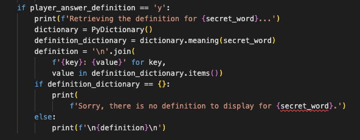

# HANGMAN GAME

Hangman Game is a Python terminal game, which runs in a mock terminal on Heroku.

Users can test their knowledge of English vacabulary. The game will allow the user to choose the word length they would like to play. They have a choice from four to nine letters. The user gets six lives to try to guess the secret word. A scoreboard will be visible with the user's high score and current max score. The game will give the user the option to get a hint, the word synonyms, when only one life remains. If the user loses, the secret word will be revealed and the player can opt to get the word's definition. These extra features added to the classic game, gives the user an educative experience while playing this Hangman Game. The game also allows the user to replay the game to increase their high score, which adds a fun and competitive element as well.

[View the live version of the Hangman Game project here](https://hangman-game-ci.herokuapp.com/)

---

## Contents

- [**How To Play**](#how-to-play)
- [**Project Goals**](#project-goals)
- [**UX - User Experience**](#ux---user-experience)
    - [User Stories](#user-stories)
- [**Design**](#design)
    - [Features](#features)
    - [Flowchart](#flowchart)
- [**Features**](#features)
    - [**Existing Features**](#existing-features)
    - [**Future Features**](#future-features)
- [**Technology Used**](#technology-used)
    - [Languages](#languages)
    - [Frameworks, Libraries & Programs](#frameworks-libraries-&-programs)       
- [**Testing**](#testing)
    - [Bugs](#bugs)
    - [Remaining Bugs](#remaining-bugs)
    - [Validator Testing](#validator-testing)
- [**Deployment**](#deployment)
- [**Credits**](#credits)
- [**Acknowledgements**](#acknowledgements)

---

## How To Play

Hangman Game is based on the classic paper-and-pencil game. You can read more about it on [Wikipedia](https://en.wikipedia.org/wiki/Hangman_(game)). In this version: 

- At the start of every game the player gets to choose the word length: from 4 to 9 letters.
- A hi-score will be displayed, reflecting the highest score attained by the player. A current max score will be calculated, which is the highest attainable score for the game with the chosen word length.
- The game starts with 6 lives and with every wrong letter guess the player will lose a life. Every new game will start with the current max score displayed which will decrease when the player loses a life.
- When there is only one life left, the player will have the option to get a hint.
- The player will win when having guessed all the word letters before losing all lives.
- The current max score remaining at the end of the game will be the final score for the game. If the game end score is higher than the displayed hi-score, the hi-score will be updated.
- If the player loses the game, the secret word will be revealed and the player will get the option to see the word's definition.
- At the end of every game the player will be given the option to replay the game to increase their hi-score or to exit the game. After the player exits the game, the game can be run again with the hi-score reset to zero.

## Project Goals

- To develop a fun educative python terminal game.
- To develop a terminal game with great user experience.
- To develop a game where the user can test their knowledge of English vocabulary.
- To develop a game where the user can broaden their English vocabulary knowledge.
- To develop a game where the user is challenged to keep improving while playing.

## UX - User Experience

### User Stories

- As a first-time user:
    - I want to be able to know which game I will be playing from the title logo.
    - I want to be able to have access to the instructions before starting the game.
- As a user:
    - I want to be able to choose from different word lengths before starting the game.
    - I want to visually be able to keep track of the game's score.
    - I want to have the opportunity to improve my score, by being able to replay the game.
    - I want to be able to choose different word lengths when replaying the game.
    - I want to have access to my hi-score. 
    - I want to be provided with a hint when I have have a hard time guessing the secret word.
    - I want to be able to improve my vocabulary knowledge, by having access to the word synonyms and definitions that I don't know.
    - I want to be able to exit the game to have a fresh start with the hi-score reset to zero. 

## Design

### Features

### Flowchart

## Features

### Existing Features

- **Landing Page**

    - The landing page features the hangman logo, which immediately clarifies to the user what the game is they are invited to play.
    - Underneath the hangman logo is a 'WELCOME!' message, to welcome the player to the game.

- **Landing Page Options**

    - Underneath the welcome message the user get's the option to see the game's instructions. If they answer 'y' (yes), they'll be taken to the 'How To Play' page. This feature is vital to inform a first time user of how the game works. As a repeat user you have the option to answer 'n' (no) to skip this step.
    - The player as a second option get's to choose the word length they would like to play. They have an option to choose a word length from 4 to 9 letters. This allows the user to choose their own challenge level. 

- **Instructions**

    - The Instructions page explains to the user how the hangman game is played and what features to expect while playing the game.
    - After the Instructions the user gets the option to choose their preferred word length for the game.

- **Game Page**

    - After having chosen a preferred word length for the game, the game page is displayed.
    - At the top a scoreboard is displayed with the High Score and Current Max Score. 
    - The High Score visualizes the highest score a player has attained when replaying the game.
    - The Current Max Score visualizes the highest possible score to attain for the game. The Current Max score points are based on the chosen word length. The longer the word length, the higher the possible game points to score. When a player loses a life, the Current Max Score decreases. The points left in the Current Max Score at the end of the game will be the player final score for the game.
    - The secret word is displayed with dashes, representing the hidden letters.
    - The player's lives are depicted through ASCI art. Every time the player loses a life, the stickman will be closer to getting hanged.
    - The player is prompted to 'guess a letter'.

- **Game Page Guess**

    - 'Letters guessed' displays the letters the player has already put as an input in 'Guess a letter'. 
    - This feature allows the player to have an easy reference to the letters they have already used as guesses.

- **Game Page Guess Feedback**

    - The game page also has a guess feedback feature, where the player gets notified when they already used a letter as an input guess.

- **Game Page Life Feedback**

    - The game page has a feedback feature where the player gets a message to let them know when they lost a life with a wrong guess.
    - The player also can view their life lose progressing with the stickman art display. Every time the player loses a life, the stickman gets closer to getting hanged.

- **Game Page Hint Option**

    - When the player has only one life left, the get the option to receive a hint. If they answer 'y' (yes), the player will be given synonyms for the secret word.
    - This feature aids the user in winning the game at the last minute, rather than losing, which makes playing the game more enjoyable.
    - This feature also serves as an educative feature, so that the player can widen their vocabulary in the process of playing the game.

- **Game Page Won Feedback**

    - The player receives a feedback message when they win the game, were they also get congratulated. This adds to a pleasant user experience for the player. 

- **Game Page Lost Feedback**

    - The player receives a feedback message when they lose the game.
    - The player can also see the stickman that got hung and turned blue in the process as a clear indicator that they lost their last life and lost the game.
    - To ease the player's frustration and to add to a better user experience, the secret word gets revealed.

- **Game Page Definition Option**

    - After losing the game, the player gets the option to see the definition for the revealed word.
    - If the player didn't know the word, they get an opportunity to broaden their vocabulary knowledge.

- **Game Page Replay Option**

    - At the end of the game, the player gets the option to replay the game.
    - Replaying the game allows the user to increase their High Score.
    - This feature makes the game more fun and engaging, while also adding a challenge to get better at guessing the game's word. 
    - This feature allows the user to keep track of their improvement progress, which gives a better user experience.

- **Game Replay Page**

    - If the user opted to replay the game, they get the choice to pick a new word length for the game. 
    - This feature allows the user to keep challenging themselves with longer words, or to have the option to also choose a shorter word as they see fit in relation to their progress.

- **Game Replay High Score**

    - The Game page after opting for a replay will update the High Score.
    - The High Score will reflect the highest score the player has attained with every replay of the game. 
    - This feature motivates the player to get a better score from previous attempts while playing the game.

- **Input validation and Error-checking**

    - The player when putting an invalid input will receive the following error message: 'Error! Please answer with either the letter y (for yes) or n (for no).'
    - The player cannot enter a space as an input.
    - The player cannot enter a keyboard key other than y or n as an input.
    - The player cannot enter a number as an input.
    - The player cannot enter another letter than y or n as an input.
    - The player cannot enter a greater input length than 1.
    - The code also accounts for unforseen player input errors, as an except statement has been implemented.
    - The same input validation and error-checking has been applied to all input statements in the game. View [**Testing**](#testing).

### Future Features

- Allow the player to input their name to provide a more personalised gaming experience.
- Have a High Score for multiple players that is accessible even after resetting the game.
- Allow the player the option to write the word in one go, when the player guesses the word.

## Technology Used

### Languages

- [Python](https://www.python.org/)

### Frameworks, Libraries & Programs

- [Git](https://git-scm.com/):
    - Git was used for version control by utilizing the Gitpod terminal to commit to Git and push to Github.
- [Github](https://github.com/):
    - Github is used to store the project's code.
- [Diagrams.net](https://app.diagrams.net/):
    - Diagrams.net was used to create and store the features diagram and hangman flowchart.
- [Heroku](https://www.heroku.com/):
    - Heroku was used to deploy the live version of the terminal.

## Testing

I have manually tested this project by doing the following:

- I have passed the code through a Python autopep8 linter and confirmed there are no problems. 

- Given invalid inputs with all the game's input questions: strings when numbers are expected, numbers when strings are expected, out of bounds inputs, no input (enter key), empty space input, wrong number or letter inputs.

- Used a print statement in my local terminal to test if a different secret word is generated on every replay and if the secret word display functions correctly.

- Tested the word list in hangman_words.py: tested to make sure all words that I added to the word list got a synonym and definition returned when web scraped. Also implemented a feedback message in the case there is a change with the api and an empty list (synonym) or dictionary (definition) for a word gets returned in the future.

- Tested in my local terminal and the Code Institute Heroku terminal.

### Bugs

#### Solved Bugs

- [StackOverflow](https://stackoverflow.com/questions/52910297/pydictionary-word-has-no-synonyms-in-the-api) provided me a solution when the api requests send by PyDictionary didn't return any synonyms.

### Remaining Bugs

- No bugs remaining.

### Validator Testing

- PEP8
    - No errors were returned from passing my code through the Python autopep8 linter.

## Deployment

This project was deployed using Code Institute's mock terminal for Heroku.

- Steps for deployment:
    - Fork or clone this repository.
    - Log in Heroku.
    - Click 'New' and select 'Create new app'.
    - Choose a name for the app, region and click on 'Create app'.
    - In 'Settings' buildpacks need to be added. Set the buildpacks to Python and NodeJS in that order. They install future dependencies that are needed outside the requirements file.
    - In 'Deploy' section link the Heroku app to the repository by connecting it to github.
    - Enter the name of the repository you want to connect it with and click 'Connect'.
    - There is a option to either deploy using automatic deploys or manual deployment, which deploys the current state of the branch.
    - Click deploy branch.
    - [View the live version of the Hangman Game project here.](https://hangman-game-ci.herokuapp.com/)

## Credits

- Code Institute for the deployment terminal.
- [Wikipedia](https://en.wikipedia.org/wiki/Hangman_(game)) for the details of the Hangman game. 
- [StackOverflow](https://stackoverflow.com/questions/52910297/pydictionary-word-has-no-synonyms-in-the-api) provided me a solution when the api requests send by PyDictionary didn't return any synonyms.

## Acknowledgements

- Thank you to my mentor Naoise Gaffney for giving me positive encouragement, guidance and support throughout the development process.
- Thank you to [Code Institute](https://codeinstitute.net/) for their information, guidance and support.
- Thank you to the Slack community for their support and information.